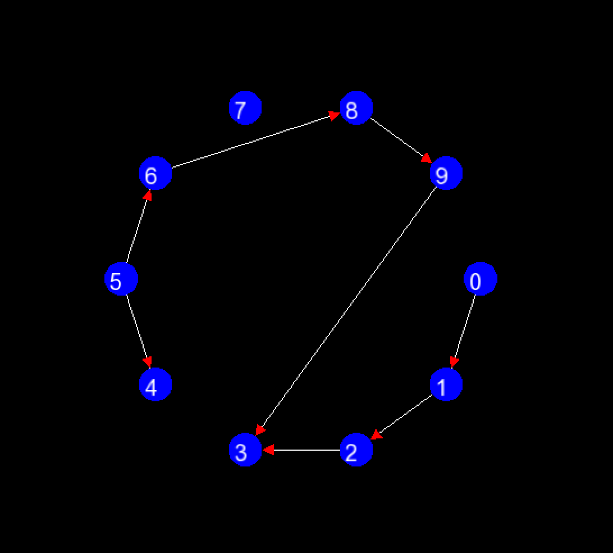

# Graphs

## Algorithms

- The graph can be visualized using [Algorithms/DrawGraph.hpp](Algorithms/DrawGraph.hpp)

It looks something like:


### Kahn's Algorithm for Topological Ordering

- Topological ordering is useful for Program build dependencies, event scheduling etc.
- We essentially remove nodes without dependencies, and their edges, and this continues till we encounter a cycle or all nodes are removed from graph
- BFS based
- Implementation [here](Algorithms/TopologicalSortKahns.cpp)

```cpp
vector<int> topologicalSort(vector<vector<int>> &graph, vector<int> &inDegree)
{
    // O(V+E) time complexity

    int n = graph.size();
    vector<int> sorted;
    queue<int> q;

    for (int i = 0; i < n; i++)
    {
        if (inDegree[i] == 0)
        {
            q.push(i);
        }
    }
    while (!q.empty())
    {
        int node = q.front();
        q.pop();
        sorted.push_back(node);

        for (int neighbour : graph[node])
        {
            inDegree[neighbour]--;
            if (inDegree[neighbour] == 0)
            {
                q.push(neighbour);
            }
        }
    }
    if (sorted.size() != n)
        sorted.clear();
    return sorted;
}
```

### DFS for Topological Ordering

- Implementation [here](Algorithms/TopologicalSortDFS.cpp)
- We maintain a recursion stack to detect cycles

```cpp
bool dfs(int node, vector<vector<int>> &adj, vector<bool> &visited, vector<bool> &recStack, stack<int> &st)
{
    visited[node] = true;  // Mark the node as visited
    recStack[node] = true; // Add the node to the recursion stack

    // Explore all neighbors
    for (int neighbor : adj[node])
    {
        if (!visited[neighbor])
        {
            // If the neighbor is unvisited, recursively visit it
            if (dfs(neighbor, adj, visited, recStack, st))
            {
                return true; // Cycle detected in the subtree
            }
        }
        else if (recStack[neighbor])
        {
            // If the neighbor is already in the recursion stack, a cycle is detected
            return true;
        }
    }

    recStack[node] = false; // Remove the node from the recursion stack
    st.push(node);          // Add the node to the stack for topological sort
    return false;           // No cycle detected
}
vector<int> topologicalSort(vector<vector<int>> &graph)
{
    int n = graph.size();
    vector<bool> visited(n, false);
    vector<bool> recStack(n, false); // Tracks the recursion stack
    stack<int> st;

    // Perform DFS for all unvisited nodes
    for (int i = 0; i < n; i++)
    {
        if (!visited[i])
        {
            if (dfs(i, graph, visited, recStack, st))
            {
                return {}; // Return an empty vector if a cycle is detected
            }
        }
    }

    // Extract nodes from the stack to get the topological order
    vector<int> sorted;
    while (!st.empty())
    {
        sorted.push_back(st.top());
        st.pop();
    }

    return sorted;
}
```